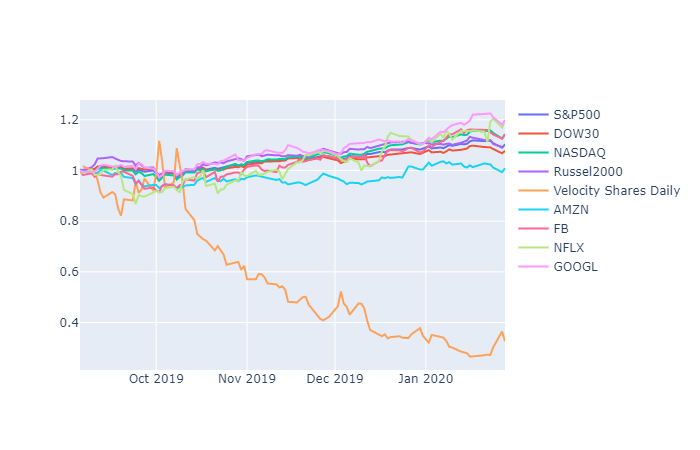

| http://current-plot.herokuapp.com/

Earthquake Plotting

1. Scrapes data from: https://earthquake.usgs.gov/
2. Plots locations and intensities of earthquakes in time animation

Stock prices plotting

1. For US stocks, gets data from: https://finance.yahoo.com/
2. For Korean stocks, from: https://finance.naver.com/
3. With respect to first day of scraped data, stock prices are compared and plotted.
